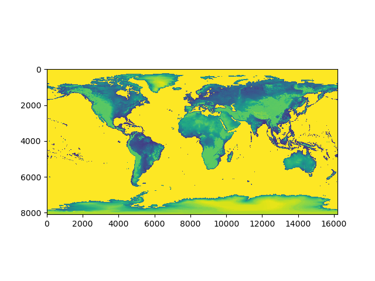
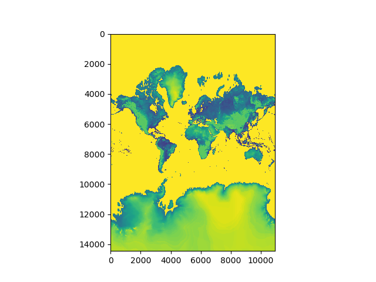
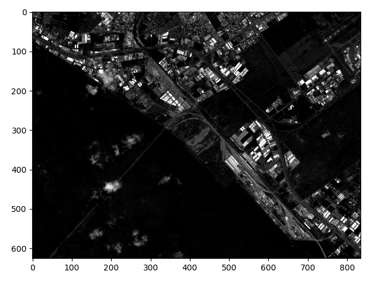
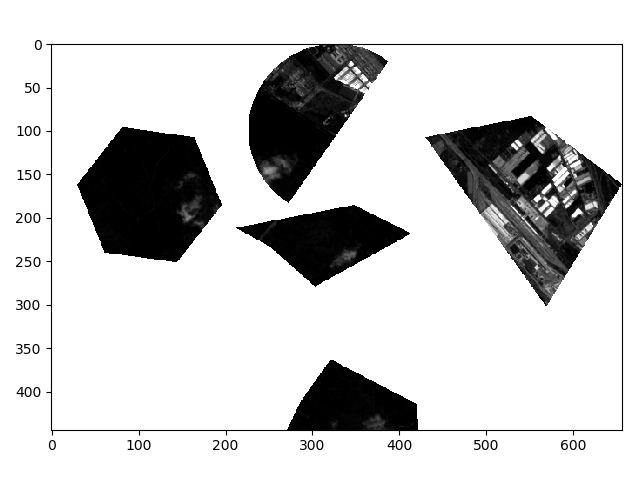

#########
Examples
#########

The examples in this page will guide you through the functionality of the xgeo.

Firstly, let's import the necessary libraries and open a data

>>> import xgeo # Needs to be imported to use geo extension
>>> import xarray as xr
>>> ds = xr.open_dataset("data.nc")

The code-blocks in the rest of the examples will start after the code-block presented above unless and otherwise
mentioned.

Geotransform
============

The geotransform of the dataset is given by the `transform` attribute. It can be accessed as

>>> ds.geo.transform
(0.022222222222183063, 0, -179.99999999999997, 0, -0.022222222222239907, 90.00000000000001)

User can also assign different geotransform. In such a case, the coordinates of the dataset will be recalculated to
comply with the changed transform. The transform can be set as:

>>> ds.geo.transform = (0.0111, 0, -180, 0, -0.0111, 90)

Projection / Coordinate Reference System (CRS)
==============================================

The projection/CRS of the Dataset is given by the `projection` attribute. XGeo converts and stores the crs system
of the dataset into the proj4 string. The CRS can be accessed as

>>> ds.geo.projection
'+init=epsg:4326'

User can also assign different crs system. The assignment can be done in multiple format. User can provide CRS in WKT,
EPSG or PROJ4 system.

.. note::
    The assignment of new CRS system doesn't reproject to it. Main purpose of this assignment is to
    provide CRS to dataset, in case of missing CRS system in dataset.

The CRS can be assigned as:

>>> ds.geo.projection = 4326

Origin of Dataset
=================

The origin of the Dataset is given in human readable format by `origin` attribute. The origin can be any one of
`top_left`, `top_right`, `bottom_left`, `bottom_right`. The origin can be accessed as:

>>> ds.geo.origin
'top_left'

User can also assign different origin to the Dataset. In such a case, the data and attributes are adjusted
accordingly to match with the new orign. The origin can be changed as:

>>> ds.geo.origin = "bottom_right"

Reproject data
=================

All the raster data (DataArrays) in the dataset can be reprojected to the new projection system by simply calling the
reproject function.

>>> dsout = ds.geo.reproject(target_crs=3857)

The result of the reprojection can be seen in two images below.

|data_4326| >> |data_3857|

Subset Data
===========

Xgeo provides two method to subset data. One method provides a mechanism to subset data with vector file while other
method allow user to slice the dataset using indices or bounds. The method providing vector file based subsetting is
called `subset` while the other is called `slice_dataset`.

>>> dsout = ds.geo.subset(vector_file='vector.shp')

|full_data|  >> |clipped_data|

.. |clipped_data| image:: _static/data_togo_clipped.png
    :width: 45%

In the example above, the size of both input and output dataset is same. However, if user want the output dataset to
fit the total bound of the vectors, it can be achieved through:

>>> dsout = ds.geo.subset(vector_file='vector.shp',crop=True)

|clipped_crop_data|

Generate Statistics
===================
The general statistics min, max, mean and standard deviations for each band and each dataset can be calculated as
follow:

>>> ds.geo.stats()
             data_mean     data_std  data_min  data_max
band time
1    0      508.532965   573.045988         1     17841
2    0      826.767885   529.762916        10     16856
3    0      776.372960   622.791312        23     16241
4    0     1233.895797   472.069397       129     12374
5    0     2107.471764   492.178186       140     11863
6    0     2343.641019   553.738875       148     12101
7    0     2287.690683   620.665450       125     15630
8    0     2534.175579   596.514672        87     12540
9    0     2040.396011   737.076977       148     14817
10   0     1480.038654  1183.614634       100     15092

The function returns a pandas dataframe with the statics to provide user with more flexibility to manipulate the output
of the statistics.

Generate Zonal Statistics
=========================
The zonal statistics min, max, mean and standard deviations for each band and each dataset can be calculated as follows:

>>> ds.geo.zonal_stats(vector_file='vector.shp', value_name="class")
                              data
class time band stat
1     0    1    mean    394.727040
                std     536.226651
                min       1.000000
                max   11437.000000
2     0    1    mean    845.517894
                std     874.189620
                min       1.000000
                max   10162.000000
3     0    1    mean    250.684041
                std     114.707457
                min     140.000000
                max    1166.000000
1     0    2    mean    735.645520
                std     512.267703
                min      10.000000
                max   12409.000000
2     0    2    mean   1148.695677
                std     799.273444
                min     121.000000
                max    8882.000000
3     0    2    mean    642.283655
                std     111.673970
                min     474.000000
                max    1488.000000
1     0    3    mean    668.089339
                std     725.145967
                min      23.000000
                max   12289.000000
2     0    3    mean   1166.711904
                std     927.510453
                            ...
           8    min     387.000000
                max    9246.000000
3     0    8    mean   3075.893308
                std     259.402703
                min    1622.000000
                max    3950.000000
1     0    9    mean   1903.334876
                std     903.854786
                min     180.000000
                max   12004.000000
2     0    9    mean   2457.078426
                std    1509.694257
                min     247.000000
                max   14817.000000
3     0    9    mean   1946.978378
                std     156.187383
                min    1067.000000
                max    2661.000000
1     0    10   mean   1197.950185
                std    1093.367547
                min     145.000000
                max   13230.000000
2     0    10   mean   2227.742274
                std    2436.064617
                min     182.000000
                max   15088.000000
3     0    10   mean    997.758945
                std     126.103658
                min     529.000000
                max    1552.000000
[120 rows x 1 columns]

The column names are generated in convention `<vector_value>_<dataset>_<variable>`. If `value_name` isn't provided, the
method takes the id of each polygon as the value_name. In such a case, the statistics will be calculated for each polygon.

Sample Pixels
=============

>>> ds.geo.sample(vector_file='vector.shp', value_name='class')
                                            data
 class x             y            time band
1.0   261009.452737 9.850486e+06 0.0  1.0   183.0
                    9.850476e+06 0.0  1.0   195.0
      261019.451371 9.850496e+06 0.0  1.0   214.0
                    9.850486e+06 0.0  1.0   211.0
                    9.850476e+06 0.0  1.0   177.0
                    9.850466e+06 0.0  1.0   195.0
                    9.850456e+06 0.0  1.0   185.0
                    9.850446e+06 0.0  1.0   193.0
      261029.450005 9.850506e+06 0.0  1.0   197.0
                    9.850496e+06 0.0  1.0   199.0
                    9.850486e+06 0.0  1.0   231.0
                    9.850476e+06 0.0  1.0   195.0
                    9.850466e+06 0.0  1.0   205.0
                    9.850456e+06 0.0  1.0   205.0
                    9.850446e+06 0.0  1.0   217.0
                    9.850436e+06 0.0  1.0   226.0
                    9.850426e+06 0.0  1.0   238.0
      261039.448639 9.850526e+06 0.0  1.0   222.0
                    9.850516e+06 0.0  1.0   213.0
                    9.850506e+06 0.0  1.0   202.0
                    9.850496e+06 0.0  1.0   189.0
                    9.850486e+06 0.0  1.0   198.0
                    9.850476e+06 0.0  1.0   192.0
                    9.850466e+06 0.0  1.0   164.0
                    9.850456e+06 0.0  1.0   179.0
                    9.850446e+06 0.0  1.0   211.0
                    9.850436e+06 0.0  1.0   220.0
                    9.850426e+06 0.0  1.0   229.0
                    9.850416e+06 0.0  1.0   217.0
                    9.850406e+06 0.0  1.0   201.0
                                           ...
3.0   264908.920002 9.847826e+06 0.0  10.0  840.0
                    9.847816e+06 0.0  10.0  845.0
                    9.847806e+06 0.0  10.0  850.0
                    9.847796e+06 0.0  10.0  854.0
                    9.847786e+06 0.0  10.0  855.0
                    9.847776e+06 0.0  10.0  850.0
                    9.847766e+06 0.0  10.0  844.0
                    9.847756e+06 0.0  10.0  836.0
                    9.847746e+06 0.0  10.0  836.0
                    9.847736e+06 0.0  10.0  846.0
                    9.847726e+06 0.0  10.0  850.0
                    9.847716e+06 0.0  10.0  850.0
                    9.847706e+06 0.0  10.0  854.0
                    9.847696e+06 0.0  10.0  860.0
                    9.847686e+06 0.0  10.0  879.0
                    9.847676e+06 0.0  10.0  911.0
                    9.847666e+06 0.0  10.0  953.0
      264918.918636 9.847786e+06 0.0  10.0  858.0
                    9.847776e+06 0.0  10.0  853.0
                    9.847766e+06 0.0  10.0  845.0
                    9.847756e+06 0.0  10.0  833.0
                    9.847746e+06 0.0  10.0  831.0
                    9.847736e+06 0.0  10.0  840.0
                    9.847726e+06 0.0  10.0  846.0
                    9.847716e+06 0.0  10.0  850.0
                    9.847706e+06 0.0  10.0  858.0
                    9.847696e+06 0.0  10.0  871.0
                    9.847686e+06 0.0  10.0  888.0
                    9.847676e+06 0.0  10.0  907.0
                    9.847666e+06 0.0  10.0  921.0
[761450 rows x 1 columns]
